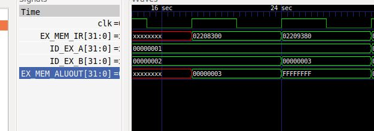
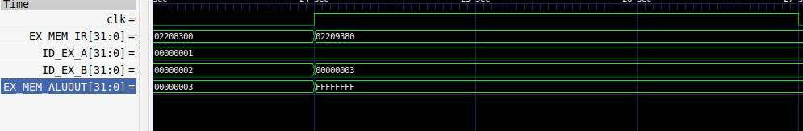
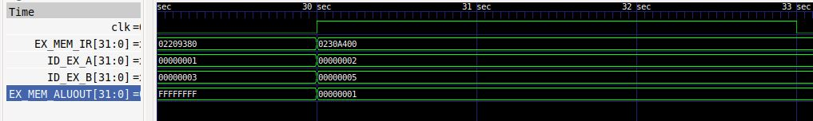
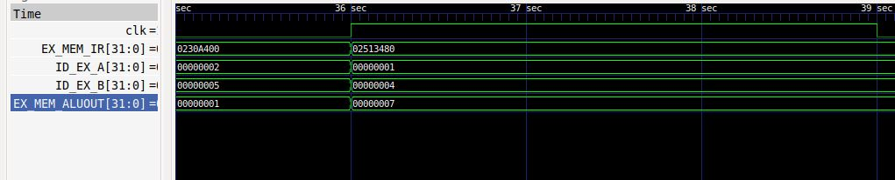
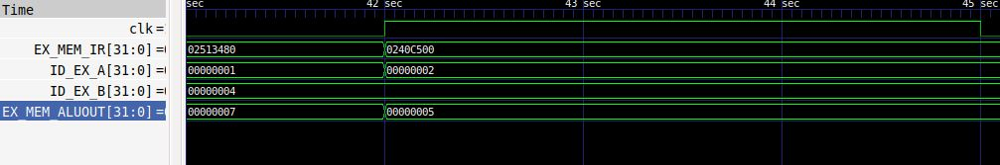
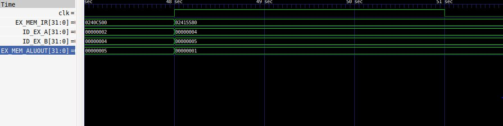
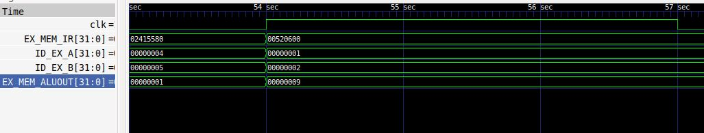
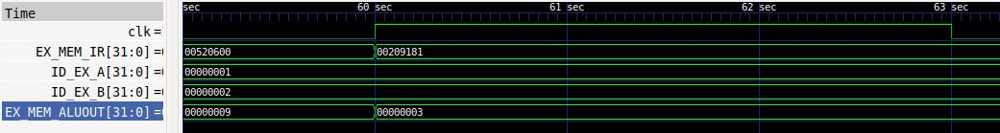
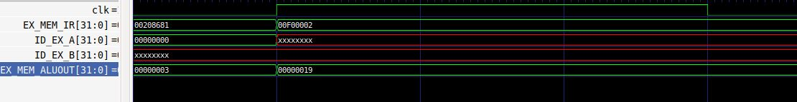
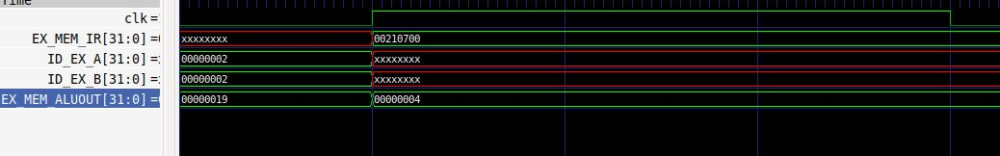

# Task 4

In this task, we use RISCV Core: Verilog Netlist and Testbench to perform an experiment of Functional Simulation and observe the waveforms. The following steps explain the process.

1. First create a new directory mkdir <Directory_name>
2. Inside that directory create two new files in the name of your own choice or maazm_rv32i.v and maazm_rv32i_tb.v
3. Open terminal and install iverilog and gtkwave using the following commands.

    `sudo apt install iverilog gtkwave`
4. Now clone the given github repository.

    `git clone https://github.com/vinayrayapati/rv32i`
The given repository contains the Verilog code and Testbench code of RISCV processor. Since this internship is not part of designing RISCV architecture, we use it as reference.
5. Copy the Verilog and Testbench code from the given repository to the two files you had created initially.
6. To perform simulation first move to the directory. Next copy the command given below.

`iverilog -o <Directory_name> maazm_rv32i.v maazm_rv32i_tb.v`
`./iiitb_rv32i`
7. Now a vsd file is generated and it is stored inside you directory. To view the generated waveforms, type the following commands.

`gtkwave iiitb_rv32i.vcd`

On the wave form viewer window, drag the following signals to view the output for each cycle.

`clk`

`EX_MEM_IR[31:0]`

`ID_EX_A[31:0]`

`ID_EX_B[31:0]`

`EX_MEM_ALUOUT[31:0]`

The waveform for each instruction is shown below.

1. add r1, r2, r3:

2. sub r7, r1, r2

3. and r8, r1, r3

4. or r9, r2, r5

5. xor r10, r1, r4

6. slt r11, r2, r4

7. addi r12, r4, 5

8. sw r3, r1, 2

9. lw r13, r1, 2

10. beq r0, r0, 15

11. add r14, r2, r2

